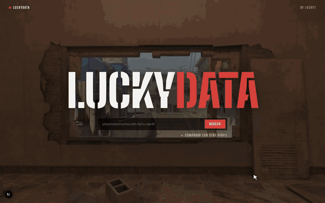
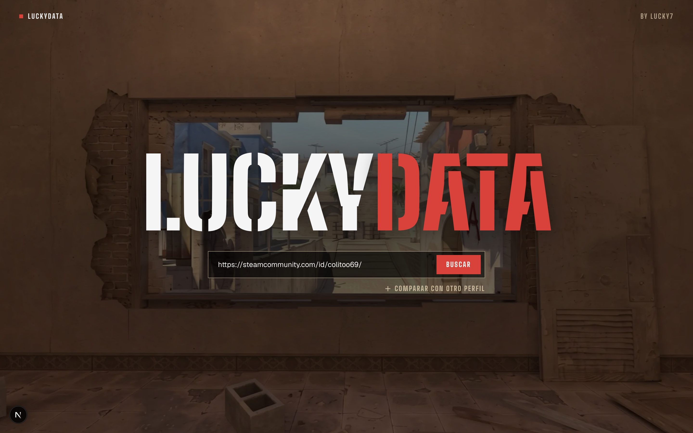
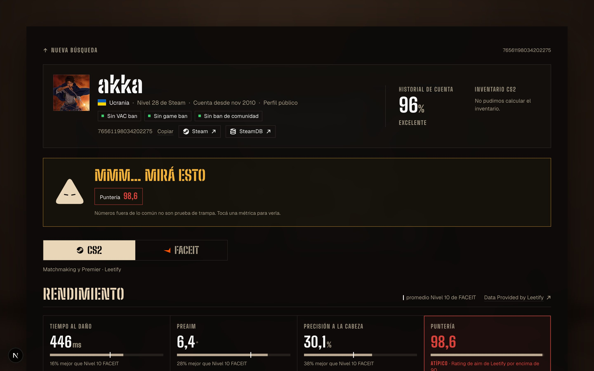
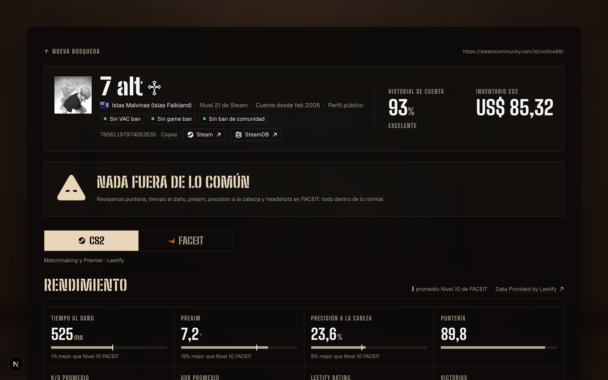
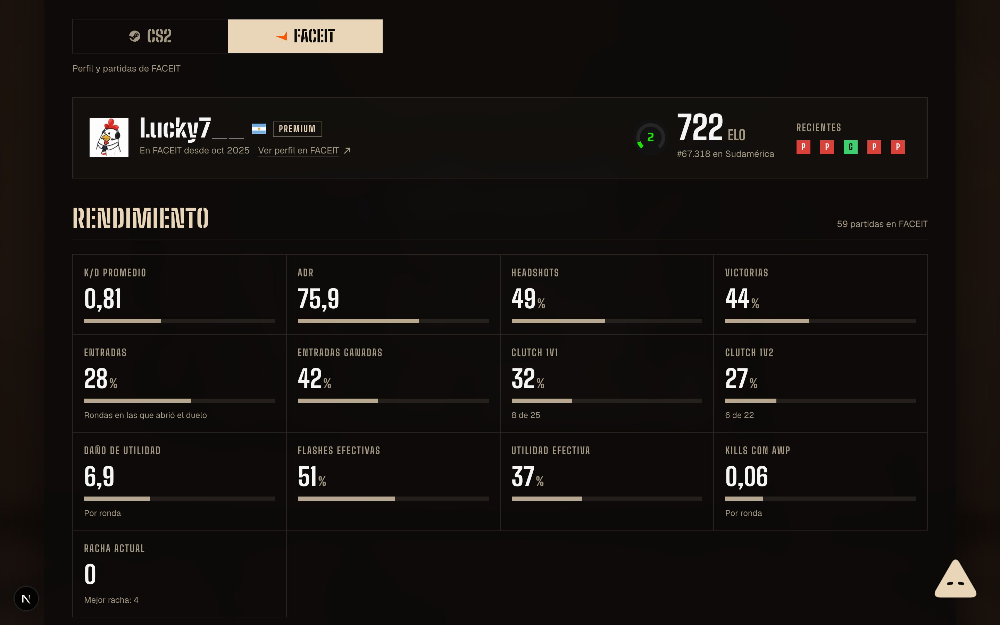
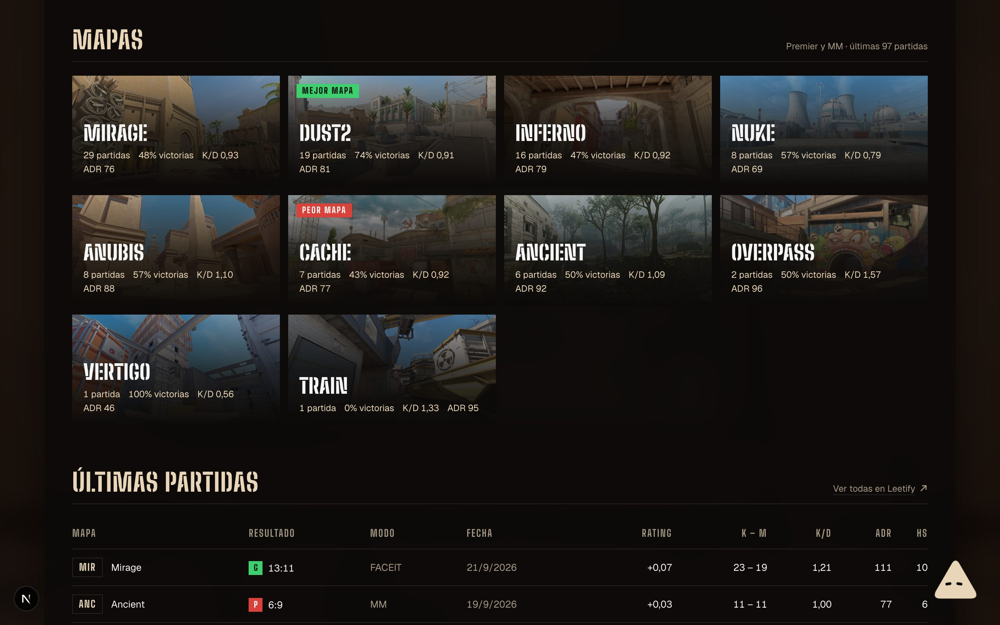
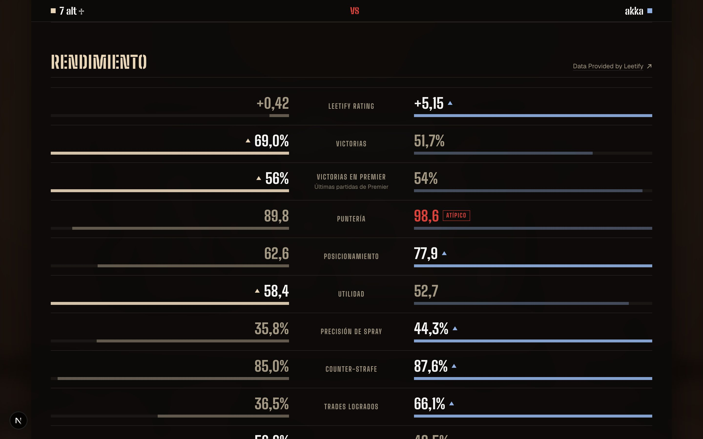

<div align="center">



# LuckyData

### ¿Ese jugador está raro? Pegá su Steam y enterate en segundos.

Estadísticas de CS2 y FACEIT en un solo lugar, con un veredicto claro<br />
cuando algún número está fuera de lo común.

</div>

---

## 🎯 ¿Para qué sirve?

Terminaste una partida y hubo alguien que pegaba **todas**. ¿Es bueno de verdad o hay algo raro?

LuckyData junta sus estadísticas finas —tiempo de reacción, preaim, precisión a la cabeza, puntería— las compara contra jugadores de **Nivel 10 de FACEIT** y te dice, sin vueltas, si algo se sale de lo normal.

<div align="center">
  
</div>

---

## 🕹️ Cómo se usa

|   |   |
|---|---|
| **1. Pegá su perfil** | El link de Steam, su URL personalizada o su SteamID. Nada más. |
| **2. Esperá unos segundos** | LuckyData trae sus datos de Steam, Leetify y FACEIT al mismo tiempo. |
| **3. Mirá el veredicto** | Arriba de todo te dice si hay algo para mirar, y te lleva directo a esa métrica. |

---

## 👀 Lo que vas a ver

<table>
  <tr>
    <td width="50%">
      
      <h3>🚨 Veredicto al instante</h3>
      Si una métrica está fuera de lo común, aparece marcada arriba y en su recuadro. Un toque y te lleva a verla.
    </td>
    <td width="50%">
      
      <h3>📊 Estadísticas finas</h3>
      Tiempo al daño, preaim, precisión a la cabeza y puntería primero: las que delatan algo raro. Cada una con la marca del promedio de Nivel 10.
    </td>
  </tr>
  <tr>
    <td width="50%">
      
      <h3>🟠 CS2 y FACEIT por separado</h3>
      Un switch para ver sus números de Premier y matchmaking, o su perfil de FACEIT: nivel, ELO, puesto en su región, clutches y más.
    </td>
    <td width="50%">
      
      <h3>🗺️ Sus mapas</h3>
      Partidas, victorias, K/D y ADR en cada mapa, con su mejor y su peor mapa marcados.
    </td>
  </tr>
  <tr>
    <td colspan="2">
      
      <h3>⚔️ Compará dos perfiles</h3>
      Dos jugadores cara a cara, métrica por métrica. Los números atípicos se marcan y <b>no cuentan como "mejores"</b>: ganarle a alguien con una puntería imposible no es rendir mejor.
    </td>
  </tr>
</table>

---

## 🔺 La mascota

Un triangulito que flota en la esquina y reacciona a lo que ve en las estadísticas.

| Cómo está | Qué significa |
|---|---|
| 🧐 **Achina los ojos** y los mueve de lado a lado | Está analizando las estadísticas. |
| 👀 **Abre bien los ojos** y te sigue con la mirada | Ninguna métrica pasa los umbrales. |
| 🤨 **Mira de reojo**, con los ojos entrecerrados | Hay algún número para mirar. |
| ❗ **Se transforma en un "!"** rojo | Varias métricas están muy fuera de lo común. |
| 😴 **Duerme** | No hay datos suficientes para opinar. |

Pasá el mouse por encima y te cuenta qué vio.

---

## 🧪 ¿Cómo decide si algo es raro?

Compara cada número contra lo que hace un jugador de **Nivel 10 de FACEIT**, el nivel más alto que se puede medir públicamente.

| Métrica | Se marca si… | Nivel 10 promedia |
|---|---|---|
| ⏱️ Tiempo al daño | es de **400 ms** o menos | 529 ms |
| 🎯 Preaim | es de **5°** o menos | 8,9° |
| 💀 Precisión a la cabeza | es de **35 %** o más | 21,9 % |
| 🔫 Puntería (Leetify) | es de **90** o más | — |
| 🟠 Headshots en FACEIT | es de **65 %** o más | — |

> [!NOTE]
> **Números fuera de lo común no son prueba de trampa.** LuckyData te señala qué mirar; la conclusión es tuya.

---

## 📡 De dónde salen los datos

| | |
|---|---|
| **Steam** | Perfil, bans, nivel, antigüedad de la cuenta e inventario. |
| **[Leetify](https://leetify.com)** | Las estadísticas finas de CS2 (Premier y matchmaking). *Data Provided by Leetify.* |
| **[FACEIT](https://www.faceit.com)** | Nivel, ELO, ranking, rendimiento, mapas y partidas de FACEIT. |

Leetify solo tiene datos de jugadores registrados ahí. Si alguien no está, LuckyData te lo avisa y te muestra lo que haya en FACEIT.

---

<details>
<summary><b>💻 Correrlo en tu compu</b></summary>

<br />

Necesitás [Node.js](https://nodejs.org) y tres claves gratuitas:

- **Steam:** [steamcommunity.com/dev/apikey](https://steamcommunity.com/dev/apikey)
- **Leetify:** [leetify.com/app/developer](https://leetify.com/app/developer)
- **FACEIT:** [developers.faceit.com](https://developers.faceit.com)

Creá un archivo `.env` en la carpeta del proyecto:

```env
STEAM_API_KEY=tu_clave
LEETIFY_API_KEY=tu_clave
FACEIT_API_KEY=tu_clave
```

Y después:

```bash
npm install
npm run dev
```

Abrí [localhost:3000](http://localhost:3000) y listo.

Para volver a grabar el video de arriba: `npm run demo` (con la app corriendo).

</details>

---

<div align="center">

Hecho por **Lucky7** · Fondo inspirado en Dust2 · No afiliado a Valve, Leetify ni FACEIT

</div>
